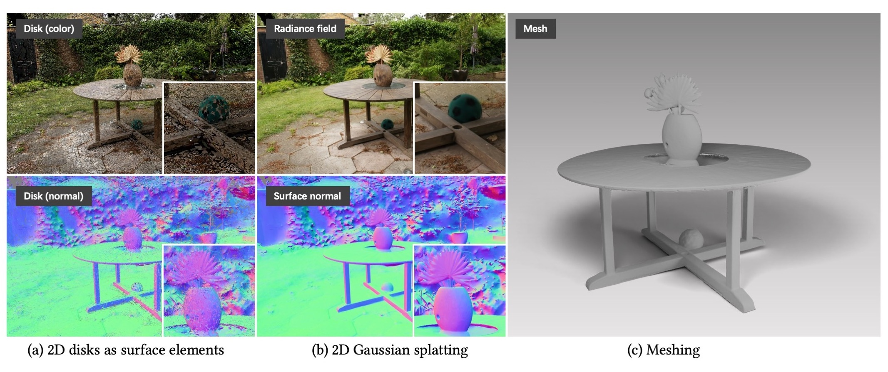

[comment]: <> (# 2DGS)

<!-- PROJECT LOGO -->

  <h1 align="center"> 2DGS (中文注释版~仅供个人学习记录用)
  </h1>

[comment]: <> (  <h2 align="center">PAPER</h2>)
  <h3 align="center">
  <a href="https://arxiv.org/pdf/2403.17888">Paper</a> 
  | <a href="https://github.com/hbb1/2d-gaussian-splatting">Original Github Page</a>
  | <a href="https://blog.csdn.net/gwplovekimi/article/details/139115674?spm=1001.2014.3001.5501">CSDN 配置教程</a>
  </h3>
  

 